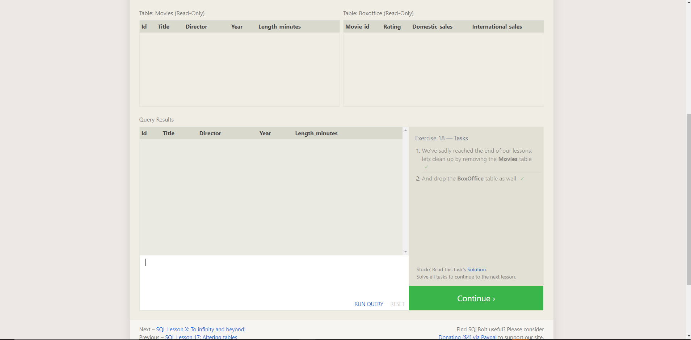

# Java Prep

## The Growth Mindset

## Upgrade your technical skills with deliberate practice

- Deliberate practice
- pushes you outside of your comfort zone
- mentally demanding and difficult
- requires goals
- challenges have to push you just outside your comfort zone.

## The power of believing that you can improve

- we can grow our brain's cpacity to learn and to solve problems
- growth mindset is the ability to develope and hone our skills
- effort and difficultly promotes new neuron connections in the brain.

### Grit: The power of passion and perseverance

- grit is passion and perseverance for very long-term goals.
- requires stamina and consistancy.
- the ability to learn is not fixed: it can change with your effort.

### Philosophy or success

- there are too many random factors (illnesses, disabilties) that prevent a society from being 100% meritocratic
- don't judge a person based on their life achievements.
- success and failure are not always earned- we all have advantages and disadvantages.
- life is about balance and finding happiness- you can't be successful at everything.
- make sure your ideas of 'success' are truly your own.

## Practice in the Terminal

1. The Command Line - it is a text based interface to the system. You are able to enter commands by typing them on the keyboard and feedback will be given to you similarly as text. CLI typically presents you with a prompt, as you type it will be displayed after the prompt. 

2. PWD stand for Print Working Directory. The Command tells you what your current or present directory is. Many commands in the CLI will rely on you being in the right location.

3. Everything is a file. A text file. a directory, your keyboard, and even your monitor. Linux is an Extensionless system. Linux system actually ignores the extension and looks inside the file to determine what type of file it is. Linux is case sensitive. Spaced in file and directory names are fine but you need to be careful. 

4. Manual pages are a set of pages that explain every command available on your system including what they do, how you run them and what command line argument they accept.  You invoke the manual pages with the following command: man(command to look up)

5. Linux organizes it's file system in a hierarchical way. It's important that we create a directory structure that will help us organize that data in a manageable way. Develop the habit of organizing your stuff into an elegant file structure now because it will benefit you in the long run. 

6. The cheat sheet is intended to be a quick reminder for the main concepts involved in using the CLI and assumes you already understand their usage. 

## Indroduction to SQL

- Structured Query Language is a language design to allow both tehcnical and non-technical users query, manipulate, and transform data from a relational database.
- Safe and scalable storage for millions of websites and mobile apps.
- A relational DB represents a collection of related (two-dimensional) tables. Each of the tables are similar to an Excel spreadsheet, with a fixed number of named columns and any number of rows of data.

### SQL Lesson 1: Select queries

- To retrieve data from a SQL DB, we need to write SELECT statements, which are often cooloquially refered to as queries.
- A query is simple just a statement which declares what data we are looking for, where to find it in the DB, and optionally, how to transform it before it is returned.
- SELECT column1, column2 FROM mytable;

### SQL Lession 2: Queries with constraints

- use WHERE clause in the query to filter out search results.
- SELECT column1, column2 FROM mytable WHERE condition AND/OR condition2 AND/OR condition3..;
- complex clauses can be contructed by joining numberous AND/OR logical keywords (num_wheels >=4 AND doors <= 2).
- writing clauses to constrain the set of rows returned also allows for the query to run faster due to the reduction of unnecessary data being returned.
- SQL doesn't require  you to write keyword all caps, but as a convention, it help people distinguish SQL keywords from column and table names, easier to read.

### SQL Lesson 3: Queries with constraints(pt. 2)

- when writing WHERE clauses with columns containing text data, SQL supports a number of useful operators to do thing like case-insensitive string comparision and wildcard pattern matching.
SELECT title, director FROM movies
WHERE title LIKE "Toy Story%";

### SQL Lesson 4: Filtering and sorting Query results

- DISTINCT keyword will blindly remove duplicate rows based on specific columns using grouping and the GROUP BY clause.
- SQL provides a way to sort your results by a given column in ascending or descending order using the ORDER BY clause.
- SELECT column, another_column, …
FROM mytable
WHERE condition(s)
ORDER BY column ASC/DESC;
- another clause used with ORDER BY are the LIMIT and OFFSET clauses, which are a useful optimization to indicate to the DB the subset of the results you care about.
- LIMIT will reduce the number of rows to return, and the optional OFFSET will specify wher eto begin counting the number of rows from.

### SQL Lesson 6: Multi-table queries with JOINs

- DB normalization is useful because it minimizes duplicate data in any single table, and allows for data in the DB to grow independently of each other.
- Queries get slightly more complex since they have to be able to find data from different parts of the DB, and perfromance issues can arise when working with many large tables.
- Tables that share information abotu a single entity need to have a primary key that identifies that entity uniquely across the DB.
- Using the JOIN clause query, we can combine row data across 2 separate tables using this unique key.
- The INNER JOIN is a process that matches rows from the first table and the second table which have the same key to create a result row with the combined columns from both tables.

SELECT title, domestic_sales, international_sales 
FROM movies
  JOIN boxoffice
    ON movies.id = boxoffice.movie_id;

SELECT title, domestic_sales, international_sales
FROM movies
  JOIN boxoffice
    ON movies.id = boxoffice.movie_id
WHERE international_sales > domestic_sales;

SELECT title, rating
FROM movies
  JOIN boxoffice
    ON movies.id = boxoffice.movie_id
ORDER BY rating DESC;

### SQL lesson 13: Inserting rows

- What is a Schema? In SQL, the DB schema is what describes the structure of each table, and the datatypes that each column of the table can contain.
- Use the INSERT statement when inserting data into a DB, which declares which table to write into, the columns of data that we are filling an don eor more rows of data to insert. INSERT INTO mytable VALUES (val1, val2);
INSERT INTO boxoffice
(movie_id, rating, sales_in_millions)
VALUES (1, 9.9, 283742034 / 1000000);

### SQL lesson 14: Updating rows

- use the UPDATE statement to update existing data.
- specify exactly which table, columns, and rows to update.
- Be extra careful when constructing UPDATE statements- don't update the wrong set of rows in a production DB, or accidently leave out the WHERE clause (which casues the update to apply to all rows)

UPDATE mytable
SET column = value_or_expr, 
    other_column = another_value_or_expr, 
    …
WHERE condition;

UPDATE movies
SET director = "John Lasseter"
WHERE id = 2;

### SQL lesson 15: Deleting rows

- use the DELETE statement when you need to delete data from a tabel in the DB.
DELETE FROM mytable
WHERE condition;
- much like the UPDATE statement, you need to be very careful when deleting data from a DB.
- run the constraint in a SELECT query first to ensure that you are removing the correct rows.
- read DELETE statement twice and execute once.

### SQL lesson 16: Creating tables

- you can create a new DB table using the CREATE TABLE statment.
- the structure of the new table is defined by its table schema, which defines a series of columns.
- each column has a name, type of data allowed in that column, an optional table constraint on values being inserted, and an optional default value.
- If table exist with the same name, the SQL implementation will usually throw an error- use the IF NOT EXISTS clause.

CREATE TABLE movies (
    id INTEGER PRIMARY KEY,
    title TEXT,
    director TEXT,
    year INTEGER, 
    length_minutes INTEGER
);

### SQL lesson 17: Altering tables

- use the ALTER TABLE statement to add, remove, or modify columns and table constraints.
- adding columns
ALTER TABLE mytable
ADD column DataType OptionalTableConstraint 
    DEFAULT default_value;
- removing columns
ALTER TABLE mytable
DROP column_to_be_deleted;
- renaming columns
ALTER TABLE mytable
RENAME TO new_table_name;

### SQL lesson 18: dropping tables

- to remove an entire tabel including all of its data and metadata, use the DROP TABLE statment.
- differs from the DELETE statement in that it also removes the table schema from the DB entirely.
- DROP TABLE IF EXISTS mytable;

## Debuggin

#### Breakpoint

- suspends a programs execution before the suspected piece of code runs. Breakpoints indicate the lines of code where the program will be suspended for you to examine its state.

#### Step-to-next-line

- steps over the current line of code and takes you to the next line.

#### Step-inside-function-call

- debugger executes the function call statement and then pauses execution at the first line of the called function.
- allows you check for logic errors in the function.

#### Step-out-of-function-call

- debugger executes the rest of the function without pausing, and then returns to the line after the function call and pauses.

